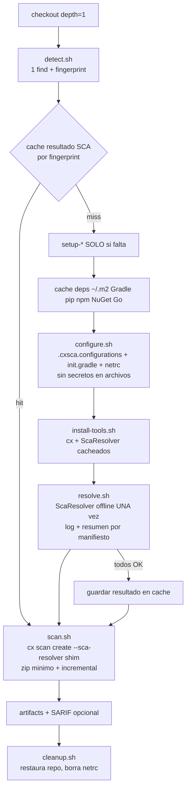

# cx-one-security · Checkmarx One (SAST + SCA) para GitHub Actions

Acción compuesta + *reusable workflow* que escanea **cualquier repositorio** (multilenguaje, monorepos, dependencias públicas y privadas en **Artifactory on‑premise**) con **cx CLI** y **Checkmarx SCA Resolver**, optimizada para que el análisis estático **no compile, no instale y descargue lo mínimo**.

```yaml
# .github/workflows/security-checkmarx.yml  (en cada repo de aplicación)
jobs:
  checkmarx:
    uses: TU-ORG/cx-one-security/.github/workflows/checkmarx-one.yml@v1
    secrets: inherit
```

---

## 1. Qué cambia respecto al esquema "un script por ecosistema"

| Antes (toolchain.sh / auth.sh / resolve.sh × lenguaje) | Ahora |
|---|---|
| N detecciones (`find` por ecosistema, y otra más en el resolver) | **1 sola pasada** con poda (`detect.sh`) → ecosistemas, toolchains, lockfiles y *fingerprint* |
| Pre-instalación: `npm ci`, `pip install`/`pip download`, `gradle dependencies`, `dotnet restore`… y **después** ScaResolver vuelve a resolver | **Sin pre-instalación**: ScaResolver ya invoca al gestor (con lockfile solo lo parsea). Se elimina la doble descarga |
| ScaResolver ejecutado por `cx` → stderr descartado, cero visibilidad | ScaResolver se ejecuta **una vez** en su propio paso con log completo, resumen por manifiesto y artifact; el JSON se entrega a `cx` con un *shim* |
| Cada corrida resuelve todo de nuevo | **Cache del resultado SCA por fingerprint** de manifiestos+lockfiles+config: si no cambió nada, **0 descargas y 0 resolución** |
| Toolchains instalados siempre (nodesource/apt/corepack/JDK) | `setup-*` **solo si falta** en el runner y **solo si hay que resolver**; con la imagen de `runner-image/` no se instala nada |
| Credenciales en `settings.xml`, `.npmrc`, `pip.conf`, `NuGet.Config` (y algunos dentro del repo → terminaban en el zip) | Archivos **sin secretos** (referencian variables de entorno); único secreto en disco: `.netrc` en `$RUNNER_TEMP` (600) que se borra al final |
| `GITHUB_ENV` con variables del scan → contaminaba los pasos siguientes del job | Entorno **privado** de la acción (`$RUNNER_TEMP/cx-one/env.sh`); secretos solo en memoria del proceso que los usa |
| Zip de SAST con `.git`, binarios, `dist/`, `target/`… (cx solo excluye `node_modules`) | Filtro por defecto que sube **solo código fuente** + `--sast-incremental` en PRs |

**Por qué un solo job y no una matriz por lenguaje:** `cx scan create` sube **un** zip con **un** `.cxsca-results.json`. Separar por ecosistema obliga a N scans/proyectos o a fusionar resultados (no soportado). La paralelización real ya ocurre en Checkmarx One (SAST y SCA corren en paralelo del lado del servidor). Dentro del job, la configuración sí está modularizada por ecosistema (`configure.sh`).

## 2. Flujo



**Clave técnica (verificada en el código de `Checkmarx/ast-cli`)**: `cx scan create --sca-resolver X` ejecuta `X offline -s <src> -n <proyecto> -r <tmp>.json <params>`, ignora la salida y solo empaqueta `<tmp>.json` como `.cxsca-results.json`. `sca-resolver-shim.sh` copia ahí el resultado ya calculado (o restaurado de cache): mismo resultado que el flujo clásico, sin resolver dos veces y con logs visibles.

## 3. Estructura

```
cx-one-security/
├── .github/workflows/
│   ├── checkmarx-one.yml          # reusable workflow (workflow_call) — punto de entrada para todos los repos
│   └── self-test.yml              # CI del repo: actionlint, shellcheck, e2e offline, integración
├── actions/checkmarx-one/
│   ├── action.yml                 # acción compuesta (orquestación, caches, setup-* condicionales)
│   └── scripts/
│       ├── lib.sh                 # utilidades, entorno privado, secretos en memoria, CA combinada
│       ├── detect.sh              # detección única + fingerprint + toolchains faltantes
│       ├── configure.sh           # Artifactory para Maven/Gradle/npm/yarn/pnpm/pip/uv/NuGet/Go/Composer/Ruby
│       ├── install-tools.sh       # cx, ScaResolver y helpers faltantes (maven, gradle, virtualenv, yarn, uv)
│       ├── resolve.sh             # ScaResolver offline (prebuilt) o preparación (cli)
│       ├── sca-resolver-shim.sh   # entrega el resultado precalculado al cx CLI
│       ├── scan.sh                # cx scan create
│       └── cleanup.sh             # siempre: restaura manifiestos, borra .netrc y config generada
├── examples/caller-workflow.yml   # workflow para copiar en cada repo de aplicación
├── runner-image/Dockerfile        # imagen ARC con toolchains + cx + ScaResolver (0 descargas por corrida)
└── tests/
    ├── run-tests.sh               # e2e sin red (ScaResolver y cx simulados con el contrato real)
    └── integration/               # Artifactory simulado con basic auth + npm/yarn/pip/gradle/mvn reales
```

## 4. Puesta en marcha

1. **Publicar este repo** en la organización (p. ej. `TU-ORG/cx-one-security`), reemplazar `TU-ORG` en `.github/workflows/checkmarx-one.yml` y `examples/`, y crear el tag `v1`. Si es privado/interno: *Settings → Actions → General → Access* → "Accessible from repositories in the organization".
2. **Artifactory**: un repo **virtual** por ecosistema que agregue el remote público + los locales privados (p. ej. `npm-virtual` = npmjs remote + `npm-private`; `maven-virtual` = Central + Google + `libs-release`). Opcional: *generic remotes* para descargar cx, ScaResolver, Maven y Gradle sin Internet.
3. **Variables y secretos de organización** (*Settings → Secrets and variables → Actions*):

| Tipo | Nombre | Ejemplo |
|---|---|---|
| var | `CX_BASE_URI` / `CX_TENANT` | `https://us.ast.checkmarx.net` / `empresa` |
| var | `ARTIFACTORY_URL` | `https://artifactory.empresa.com/artifactory` |
| var | `CX_NPM_REPO`, `CX_MAVEN_REPO`, `CX_PYPI_REPO`, `CX_NUGET_REPO`, `CX_GO_REPO`, `CX_GRADLE_PLUGINS_REPO` | `npm-virtual`, `maven-virtual`, … |
| var | `CX_RUNS_ON` | `["self-hosted","linux","x64","appsec"]` |
| var (on‑prem) | `CX_CLI_URL`, `CX_SCA_RESOLVER_URL`, `CX_MAVEN_DIST_URL`, `CX_GRADLE_DIST_URL`, `CX_GRADLE_DIST_BASE_URL` | URLs del *generic remote* con `{version}` / `{arch}` |
| var (opcional) | `CX_LEGACY_HOSTS` | `artifactory.lima.empresa.com=artifactory2.lima.empresa.com` |
| var (opcional) | `CX_CA_BUNDLE` | `/etc/ssl/corp/ca.pem` (ruta en el runner) |
| var (con runner-image) | `CX_CLI_VERSION=system`, `CX_SCA_RESOLVER_VERSION=system` | usa los binarios de la imagen |
| secret | `CX_CLIENT_ID` + `CX_CLIENT_SECRET` (o `CX_APIKEY`) | OAuth client de Checkmarx One |
| secret | `ARTIFACTORY_USER` + `ARTIFACTORY_PASSWORD` (opcional `ARTIFACTORY_TOKEN`) | usuario de servicio *read-only* |

4. Copiar `examples/caller-workflow.yml` en cada repo (o imponerlo con **required workflows / rulesets** de la organización).

## 5. Inputs principales

| Input | Default | Para qué |
|---|---|---|
| `resolution-mode` | `prebuilt` | `prebuilt`: resuelve en su paso + cache + shim. `cli`: ScaResolver lo ejecuta `cx` (paridad con el flujo clásico / *delta scan* del servidor). `server`: sin resolver local (solo dependencias públicas) |
| `result-cache` / `result-cache-ttl` | `true` / `weekly` | Reutiliza el resultado si manifiestos, lockfiles y config no cambiaron. El TTL fuerza re-resolución periódica para rangos sin lockfile (`^1.2`, `>=2.0`) |
| `dependency-cache` | `true` | Cache de `~/.m2`, Gradle, pip, uv, npm, yarn, NuGet, Go (clave por fingerprint con `restore-keys`) |
| `install-toolchains` | `true` | `setup-java/node/python/dotnet/go` solo para lo que falte; respeta `.nvmrc`, `.python-version`, `global.json`, `go.mod` |
| `python-package-manager` | `pip` | `uv` acelera mucho repos Python grandes |
| `ignore-dev-dependencies` | `false` | `--ignore-dev-dependencies --ignore-test-dependencies` |
| `resolver-extra-params` | | p. ej. `--gradle-exclude-scopes testCompileClasspath`, `--maven-parameters "-P ci"` |
| `strict` | `false` | Falla si algún manifiesto no resuelve (`--break-on-manifest-failure`) |
| `file-filter-extra` | | Exclusiones extra del zip SAST (p. ej. `!test,!*.spec.ts`) |
| `sast-incremental` | `auto` | Incremental en `pull_request` |
| `upload-sarif` | `false` | Publica en *Code Scanning* (requiere GHAS) |

Outputs: `scan-id`, `ecosystems`, `sca-source` (`cache`/`resolved`/`cli`/`server`/`none`), `report-dir`.

**Políticas:** se gestionan únicamente en la UI de Checkmarx One (*Policy Management*). `cx scan create` las evalúa al terminar el scan y, si una política con *Break Build* se viola, termina con error y el job falla. El workflow no define ningún gate propio.

## 6. Resolución de dependencias por ecosistema

| Ecosistema | Qué necesita ScaResolver | Qué hace la acción (sin instalar en el repo) |
|---|---|---|
| Maven | JDK + `mvn` | `.cxsca.configurations/settings.xml` con *mirror* al virtual y `${env.CX_ART_*}` |
| Gradle | JDK + `gradlew`/`gradle` | `GRADLE_USER_HOME` con `init.d`: reescribe host legado, redirige Central/Google/JitPack y `plugins.gradle.org` a Artifactory e inyecta credenciales (incluye `pluginManagement` de `settings.gradle`). Wrapper: `distributionUrl` temporal a `CX_GRADLE_DIST_BASE_URL` |
| npm / pnpm / yarn | `npm`/`yarn` (con lockfile solo parsea; sin lockfile `--package-lock-only`) | `.npmrc` sin secretos (`_auth=${CX_NPM_AUTH}`), scopes `@empresa:registry` del repo, `ignore-scripts=true`; yarn v1 (`YARN_REGISTRY`/`YARN__AUTH`) y berry (`YARN_NPM_*`) |
| pip / setuptools | `python3` + `virtualenv` (ScaResolver crea un venv por manifiesto) | `PIP_INDEX_URL` + `.netrc`, `PIP_PREFER_BINARY`, cache compartida; instala `virtualenv` en `PYTHONUSERBASE` cacheado si falta |
| uv / Poetry | `uv` / `poetry` | `UV_DEFAULT_INDEX` + `.netrc`; Poetry usa las `[[tool.poetry.source]]` + `.netrc` |
| NuGet | `dotnet` | `.cxsca.configurations/nuget.config` con `%CX_ART_*%` + `NuGetPackageSourceCredentials_*` |
| Go | `go` | `GOPROXY` al virtual, `GOFLAGS=-mod=mod`, `.netrc` |
| Composer / Ruby | `composer` / `bundler` (si no hay lockfile) | `COMPOSER_AUTH` / `BUNDLE_<HOST>` en memoria |
| pnpm-lock, Pub, Carthage, SwiftPM con `Package.resolved` | nada | se parsea el lockfile |

**React Native / Expo:** `settings.gradle` incluye el plugin desde `node_modules`. Es el **único** caso en que se instalan dependencias JS (`--ignore-scripts`, lockfile congelado, pnpm con `node-linker=hoisted` para que el plugin quede donde lo espera Gradle, sin symlinks). AGP necesita un SDK: se crea un `ANDROID_HOME` mínimo con licencias.

**Versionar lockfiles** (`package-lock.json`, `gradle.lockfile`, `packages.lock.json`, `go.sum`, `composer.lock`, `Gemfile.lock`) hace la resolución más rápida y determinista. `detect.sh` los reporta en el *step summary*.

## 7. Seguridad (AppSec)

- **Ningún secreto en archivos dentro del repo.** `settings.xml`, `.npmrc` y `nuget.config` se **suben a Checkmarx** junto con los manifiestos (*Files Used for Manifest Resolution*), por eso solo contienen referencias a variables. `.cxsca.configurations/` se elimina antes de comprimir y además se excluye en `--file-filter`.
- **Secretos solo en memoria** (`load_secret_env`), enmascarados (`::add-mask::`); credenciales de Checkmarx por variables de entorno, nunca como argumentos (`ps`/logs).
- **`ignore-scripts=true`** y `YARN_ENABLE_SCRIPTS=false`: resolver dependencias nunca ejecuta *lifecycle scripts* de terceros.
- Acciones de terceros **fijadas por SHA**. Activar Dependabot (`github-actions`) en este repo para actualizarlas.
- Descargas con verificación SHA‑256 cuando el publicador entrega `.sha256sum` (ScaResolver).
- `persist-credentials: false` en el checkout; permisos mínimos del job.
- Inputs libres (`resolver-extra-params`, `extra-scan-args`) se evalúan con `eval` para respetar comillas: vienen del YAML del workflow que llama (fuente confiable), **nunca** los alimentes con datos del PR (títulos, ramas, etc.).

## 8. Diagnóstico rápido

| Síntoma (step summary / artifact `cx-one-*` → `sca-logs`) | Causa / acción |
|---|---|
| `[Status=PrerequisiteFailed]` en `requirements*.txt` y `No module named virtualenv` | El python del runner no tiene `virtualenv` y no pudo instalarse: revisar `pypi-repo`/credenciales o usar la imagen de `runner-image/` |
| 401 en el log | Usuario/clave de Artifactory. 403: permisos, política Xray o *include/exclude* del remote. 404: el paquete no está en el virtual |
| `SDK location not found` | Proyecto Android: definir `ANDROID_HOME` en la imagen del runner |
| `Included build '…/node_modules/@react-native/gradle-plugin' does not exist` | Revisar que `react-native-support` esté en `true` y que el lockfile JS sea instalable |
| SCA con 0 dependencias y `sca-source=server` | No hubo resultado local (ver el warning del paso *resolve*); con `strict: true` el job falla en lugar de degradar |
| Necesito ver qué hace el CLI | `debug: true` (agrega `--debug` a `cx`) |

## 9. Migración desde la shared library de Jenkins / scripts por ecosistema

| Antes | Ahora |
|---|---|
| `CX_SCA_PIP_INDEX_URL`, `CX_SCA_MAVEN_REPO_URL`, `CX_SCA_NPM_REGISTRY`, `CX_SCA_NUGET_SOURCE` | `artifactory-url` + `pypi-repo` / `maven-repo` / `npm-repo` / `nuget-repo` |
| `CX_SCA_ARTIFACTORY_USER/PASSWORD` | secrets `ARTIFACTORY_USER` / `ARTIFACTORY_PASSWORD` |
| `CX_SCA_PREFLIGHT_MODE` (light/full) | Ya no hace falta: el log real de ScaResolver y su resumen por manifiesto están en cada corrida |
| `CX_SCA_RESOLVER_DIAGNOSTICS` | Siempre activo (`--log-level Debug` a archivo, consola filtrada, artifact) |
| `CX_SCA_MANIFESTS_EXCLUDE` → `--manifests-exclude-pattern` | **Ese flag no existe en ScaResolver**; el correcto es `-e/--excludes` → input `resolver-excludes` |
| `--no-upload-manifest` en `--sca-resolver-params` | Solo aplica en modo *Online* de ScaResolver; el CLI usa *offline*, no tiene efecto |
| `LEGACY_ARTIFACTORY_HOST` → `ARTIFACTORY_HOST` | `legacy-hosts: viejo=nuevo` (reescritura temporal + `init.gradle`, restaurada siempre) |

## 10. Pruebas

```bash
bash tests/run-tests.sh                       # 40 casos e2e sin red (detección, config sin secretos, rewrites, shim, cli, política, limpieza)
bash tests/integration/run-integration.sh     # npm, yarn, pip, gradle y mvn REALES contra un Artifactory simulado con basic auth
```

Ambas suites, `actionlint` y `shellcheck` (nivel *style*) pasan en `self-test.yml`.

## 11. Límites conocidos

- La validación contra un tenant real de Checkmarx One y el binario real de ScaResolver debe hacerse en su entorno (la suite usa simuladores que respetan el contrato del CLI). Recomendado: un repo piloto por ecosistema con `strict: false` y revisar el resumen por manifiesto.
- En `prebuilt`, ScaResolver se ejecuta fuera del CLI, por lo que no usa el *delta scan* del servidor (el CLI le pasa un token solo cuando él lo invoca). La cache por fingerprint cubre ese ahorro; si se prefiere el delta del servidor, usar `resolution-mode: cli`.
- Poetry y Composer usan los repositorios declarados en el propio `pyproject.toml` / `composer.json` (la acción aporta credenciales, no puede redefinir sus *sources*).
- ScaResolver solo se publica para Linux x64.
- Las acciones oficiales fijadas usan `node24`: el runner debe estar actualizado.
